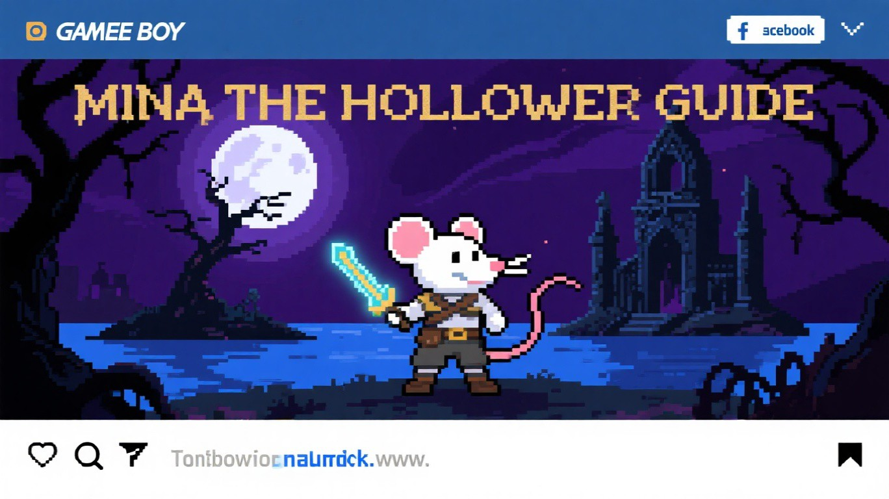

# Mina the Hollower Walkthrough Guide

A comprehensive fan-made walkthrough guide for **Mina the Hollower**, the gothic horror action-adventure game by Yacht Club Games.



## Overview

This guide provides detailed information on:

- **Area Walkthroughs** - Complete guides for all locations in Tenebrous Isle
- **Boss Strategies** - Detailed tactics for defeating all bosses
- **Enemy Bestiary** - Information on all enemies and their behaviors
- **Items & Equipment** - Weapons, sidearms, trinkets, and collectibles
- **Game Mechanics** - Explaining the burrow system, Bones currency, Plasma healing, and more
- **Tips & Tricks** - Essential strategies for beginners and advanced players
- **FAQ** - Answers to common questions
- **Glossary** - Definitions of game-specific terms

## Live Website

The guide is deployed on Cloudflare Pages: **https://YOUR-DOMAIN.pages.dev**

*(Replace with your actual Cloudflare Pages URL after deployment)*

## File Structure

```
mina-hollower-guide/
├── index.html          # Homepage
├── walkthrough.html    # Area walkthroughs
├── bosses.html         # Boss guide
├── enemies.html        # Enemy bestiary
├── items.html          # Items & equipment
├── mechanics.html      # Game mechanics
├── tips.html           # Tips & tricks
├── faq.html            # Frequently asked questions
├── glossary.html       # Game terms glossary
├── sitemap.xml         # XML sitemap for SEO
├── robots.txt          # Robots.txt for crawlers
├── _redirects          # Cloudflare Pages redirects
├── _headers            # Cloudflare Pages headers
├── css/
│   └── style.css       # Main stylesheet
├── js/
│   └── main.js         # Main JavaScript file
└── images/             # Image assets
    ├── favicon.png
    ├── og-image.jpg
    └── ... (other game images)
```

## Deployment

This site is configured for deployment on **Cloudflare Pages**. See [DEPLOYMENT.md](DEPLOYMENT.md) for detailed instructions.

### Quick Deploy

1. Fork or clone this repository
2. Connect your GitHub repo to Cloudflare Pages
3. Deploy with no build settings (static HTML)
4. Update the placeholder URLs in the HTML files with your actual domain

## Customization

### Updating Domain URLs

Before deploying, update the following files with your actual domain:

1. **HTML files** - Update `og:url` and `twitter:url` meta tags if you want absolute URLs
2. **sitemap.xml** - Replace relative URLs with absolute URLs including your domain
3. **robots.txt** - Update the Sitemap URL with your actual domain

The current setup uses relative URLs (`/`) which work fine on Cloudflare Pages.

### Adding Content

To add new sections or update existing content:

1. Edit the relevant `.html` file
2. Follow the existing HTML structure and CSS classes
3. Update the sitemap.xml `lastmod` date if making significant changes
4. Test locally before committing

## Technologies Used

- **HTML5** - Semantic markup
- **CSS3** - Custom styling with CSS variables
- **Vanilla JavaScript** - No frameworks, minimal JS for interactivity
- **Cloudflare Pages** - Static site hosting

## Browser Support

- Chrome/Edge (latest)
- Firefox (latest)
- Safari (latest)
- Mobile browsers (iOS Safari, Chrome Mobile)

## Contributing

This is a fan-made guide. Contributions are welcome:

1. Fork the repository
2. Create a feature branch (`git checkout -b feature/improvement`)
3. Make your changes
4. Commit your changes (`git commit -am 'Add new content'`)
5. Push to the branch (`git push origin feature/improvement`)
6. Open a Pull Request

### Content Guidelines

- Keep information accurate and up-to-date with the game
- Use clear, concise language
- Include spoiler warnings where appropriate
- Cite game version numbers for major updates

## License

This project is licensed under the MIT License - see the [LICENSE](LICENSE) file for details.

This is a fan-made guide and is not affiliated with or endorsed by Yacht Club Games. Mina the Hollower is a trademark of Yacht Club Games.

## Credits

- **Game**: Mina the Hollower by Yacht Club Games
- **Guide**: Community-driven walkthrough
- **Hosting**: Cloudflare Pages

## Support

For issues, suggestions, or corrections, please open an issue on GitHub.

---

**Disclaimer**: This guide may contain spoilers for Mina the Hollower. Proceed at your own risk!
